# Sub by Audiocraft — Ayrıntılı Teknik İnceleme ve Geliştirme Planı

Son güncelleme: 28 Temmuz 2026

İncelenen taban: 1.18.1 (43)

Birincil hedef cihaz: iPhone 14

Temel ürün kararı: Ücretsiz, cihaz içinde çalışan, dış API anahtarına bağımlı olmayan iş akışı

## 1. Ürün hedefi

Uygulamanın ana vaadi şudur:

1. Kullanıcının kendi müzik videosunu güvenli biçimde içeri al.
2. Türkçe vokali mümkün olan en doğru metin ve kelime zamanlarıyla çöz.
3. Hataları hızlıca bulup düzeltmeyi kolaylaştır.
4. Klasik karaoke veya parçaya uyumlu, profesyonel kinetik tipografi üret.
5. Ön izlemede görülen sonucu aynı yerleşim ve zamanlamayla videoya işle.
6. Uzun bir parçada iPhone 14 belleğini aşmadan tamamla.
7. Projeyi ve kaynak videoyu veri kaybı olmadan sakla.
8. İnternet yalnız ilk model indirmesi için gerekebilsin; günlük kullanımda ücretli bir servise bağımlı olmasın.

Başarı yalnız “uygulama açılıyor” ile ölçülmeyecek. Aşağıdaki ürün ölçütleri kullanılacak:

| Alan | Ana ölçüt | Hedef |
|---|---|---|
| Kararlılık | Analiz ve dışa aktarmada kullanıcıya görünen kapanma | Test setinde 0 |
| Bellek | iPhone 14 üzerinde analiz tepe belleği | Her sürümde ölçülür, gerileme engellenir |
| Metin | Türkçe şarkı sözü WER/CER | Sürüm bazında düşmeli |
| Zaman | Kelime başlangıç/bitiş mutlak hata ortalaması | Benchmark setinde ölçülür ve düşmeli |
| Veri | Bozuk/kaybolan proje | 0; bozuk dosya kullanıcıya görünür ve kurtarılabilir |
| Görsel | Ön izleme–dışa aktarma farkı | Referans kare toleransı içinde |
| Kullanılabilirlik | Yanlış bir kelimeyi bulup düzeltme süresi | Dalga biçimi editörüyle belirgin biçimde azalmalı |
| CI | Aynı commit’in bağımlılık çözümleme sonucu | Tekrarlanabilir ve kilitli |

## 2. Mevcut sistemin haritası

```mermaid
flowchart LR
    A["PhotosPicker ile video"] --> B["Geçici kaynak kopyası"]
    B --> C["FFmpeg ile 16 kHz mono WAV"]
    C --> D["WhisperKit zamanlama geçişi"]
    D --> E["İsteğe göre ikinci zamanlama geçişi"]
    E --> F["Whisper modelini boşalt"]
    F --> G["Qwen3-ASR söz düzeltme"]
    G --> H["Sıra eşleme ve zamanları koruma"]
    H --> I["Satır düzenleyici"]
    I --> J["Kelime/zaman/stil düzenleyici"]
    J --> K["ASS olayları ve kinetik sahne planı"]
    K --> L["FFmpeg donanımsal H.264 kodlama"]
    L --> M["Fotoğraf galerisi"]
    H --> N["Documents/Projeler içinde JSON + video"]
    J --> N
```



Mevcut yaklaşımın güçlü tarafları:

- Whisper ve Qwen aynı anda bellekte tutulmuyor.
- iPhone 14 sınıfında büyük Whisper yerine küçük modeller seçiliyor.
- Qwen başarısız olursa Whisper zamanlı sonucu korunuyor.
- İşlemler kimlik ile izleniyor; geç kalan callback eski ekran durumunu bozmuyor.
- Kaydedilmemiş galeri çıktısı hemen silinmiyor; kullanıcı izin sorununu düzelterek tekrar deneyebiliyor.
- ASS üretimi için geniş bir seçenek matrisi ve deterministik kinetik yönetmen testleri var.
- Eski proje alanları optional tutularak geriye dönük açılabiliyor.
- MLX, CI’da `CudaBuild` eklenti iznine takılmayan 0.31.4 sürümüne sabitlendi.

## 3. İnceleme bulguları

### Öncelik tanımı

- **P0:** Kapanma, veri kaybı, derleme/dağıtımın durması veya ciddi lisans/güvenlik riski.
- **P1:** Söz ve zaman doğruluğu, dışa aktarma kalitesi veya temel iş akışında belirgin kusur.
- **P2:** Profesyonel görsel kalite, hız ve ileri düzenleme yeteneği.
- **P3:** Mimari sürdürülebilirlik, erişilebilirlik ve ürün cilası.

### Bulgular tablosu

| Kimlik | Öncelik | Bulgu | Kanıt / etkisi | Durum |
|---|---:|---|---|---|
| MEM-01 | P0 | Qwen aşamasında tüm WAV belleğe alınıyordu | 20 dk, 16 kHz mono ses yalnız kalıcı `[Float]` dizi için yaklaşık 76,8 MB; okuma tamponuyla anlık yaklaşık 154 MB. Qwen belleği buna ekleniyordu. | **1.19.0’da düzeltildi:** yalnız ilgili 12–14,5 sn pencere okunuyor |
| MEM-02 | P0 | Gerçek cihaz tepe bellek ölçümü ve jetsam kaydı yok | Kapanma düzeltmesinin işe yarayıp yaramadığı sürüm bazında ölçülemiyor. | Planlandı |
| MEM-03 | P1 | Bellek uyarısında model/ön izleme kaynaklarını bırakma politikası yok | iOS baskı altında uygulamayı sonlandırabilir. | Planlandı |
| DAT-01 | P0 | Bozuk proje JSON’u sessizce listeden kayboluyor | `try?` ile okuma/çözme başarısızlığı yutuluyor; kullanıcı projesini neden göremediğini bilmiyor. | Planlandı |
| DAT-02 | P0 | Proje şema sürümü, yedek ve kurtarma kaydı yok | Gelecekteki alan değişikliklerinde kontrollü migration yapılamıyor. | Planlandı |
| DAT-03 | P1 | Otomatik kayıt JSON’u ana iş parçacığında yazıyor | Büyük kelime listelerinde hızlı düzenleme sonrası kısa takılma oluşturabilir. | Planlandı |
| DAT-04 | P1 | Kayıt/silme hataları yalnız `print` ile bildiriliyor | Depolama doluluğu veya dosya sağlayıcı hatası kullanıcıya ulaşmıyor. | Planlandı |
| ASR-01 | P1 | “Belirsiz kelime” kavramı veri modelinde yok | Whisper/Qwen anlaşmazlığı kullanıcıya işaretlenmiyor; bütün sözleri gözle taramak gerekiyor. | Planlandı |
| ASR-02 | P1 | Kalite, gerçek şarkı benchmark’ı olmadan model adına göre seçiliyor | Daha büyük modelin her zaman Türkçe şarkıda daha iyi olduğu kanıtlanmış değil. | Planlandı |
| ASR-03 | P1 | Qwen pencereleri kesim çevresinde bağlamı paylaşmıyor | Uzatılan hece/pencere sınırındaki sözcük düzeltmesi zayıflayabilir. | Planlandı |
| ASR-04 | P1 | İki zaman geçişinin güveni saklanmıyor | Birleşen zamanın güvenilirliği sonradan değerlendirilemiyor. | Planlandı |
| ASR-05 | P2 | Model indirme/önbellek yönetimi ürün özelliği değil | Hangi model hazır, ne kadar yer kaplıyor, indirme iptal/tekrar durumu görünmüyor. | Planlandı |
| EDT-01 | P1 | Zaman düzenleme yalnız 0,1 sn düğmeleriyle yapılıyor | Müzik üzerinde doğru giriş/çıkış yakalamak yavaş; dalga biçimi ve yakınlaştırma yok. | Planlandı |
| EDT-02 | P1 | Kelime ekleme yalnız listenin sonuna “Yeni” ekliyor | Araya eksik kelime koymak, bölmek/birleştirmek ve komşu zamanları paylaştırmak zor. | Planlandı |
| EDT-03 | P1 | Geri al/yinele yok | Yanlış toplu satır bölme veya silme kolayca geri alınamıyor. | Planlandı |
| EDT-04 | P2 | Uzun listede aktif kelimeye otomatik kaydırma/arama yok | Yüzlerce kelimeli parçada düzeltme süresi büyüyor. | Planlandı |
| REN-01 | P1 | Dışa aktarma sabit H.264 ve 12 Mbit/s | Kaynak çözünürlük, kare hızı ve HDR niteliğine göre uyarlanmıyor; HDR kaynak SDR’a dönüşebilir. | Planlandı |
| REN-02 | P1 | Gerçek kodlama ilerlemesi yok | Uzun videoda uygulama donmuş gibi görünüyor. | Planlandı |
| REN-03 | P1 | Açık ses/video track eşleme politikası yok | Çoklu ses veya sıra dışı dosyalarda yanlış track seçimi riski var. | Planlandı |
| REN-04 | P1 | SwiftUI ön izleme ile ASS iki ayrı çizim yolu | Font ölçüsü, satır konumu ve animasyon dışa aktarmada farklılaşabilir. | Planlandı |
| REN-05 | P2 | Çıktı profili seçimi yok | “Hızlı ön izleme / yüksek kalite / kaynak uyumlu” gibi kontrollü seçenekler bulunmuyor. | Planlandı |
| KIN-01 | P1 | Otomatik yönetmen gerçek ses enerjisini/beat’i ölçmüyor | Mevcut kararlar söz, süre, tekrar ve boşluklardan geliyor; enstrümantal vurgu ve davul girişi görülemiyor. | Planlandı |
| KIN-02 | P1 | Şarkı bölümleri olasılık/güven ile modellenmiyor | Açılış, yükseliş ve nakarat çıkarımı daha çok tipografik sezgiye dayanıyor. | Planlandı |
| KIN-03 | P2 | Sahne planı kalıcı proje verisi değil | Algoritma güncellenince eski projenin görünümü değişebilir; kullanıcı belirli sahneyi kilitleyemiyor. | Planlandı |
| KIN-04 | P2 | Font yetenekleri sınırlı meta veriyle seçiliyor | Script/display/condensed olmasının yanında Türkçe glif, ağırlık, x-height ve bağlanan yazı güvenliği ölçülmüyor. | Planlandı |
| ARC-01 | P2 | `VideoProcessor.swift` yaklaşık 4.500 satır ve çok sorumluluklu | Model indirme, ASR, hizalama, tipografi, ASS, FFmpeg ve dosya temizleme aynı sınıfta. | Planlandı |
| ARC-02 | P2 | UI iş akışı tek `ContentView` içinde çok sayıda bağımsız state taşıyor | Geçiş kuralları tip güvenli değil; beklenmeyen state kombinasyonları mümkün. | Planlandı |
| ARC-03 | P2 | `ProjectStore` actor/main-actor sınırı belirtmiyor | `@Published` mutation ve arka plan kapak üretimi gelecekte Swift 6 denetiminde sorun çıkarabilir. | Planlandı |
| UX-01 | P2 | Hata tipi yerine kullanıcı metni karşılaştırılıyor | İptal durumu `"İşlem iptal edildi."` metnine bağlı; yerelleştirme ve hata ayrımı kırılgan. | Planlandı |
| UX-02 | P2 | Erişilebilirlik ve Dynamic Type kapsamı sınırlı | Çok sayıda sabit font/frame ve yalnız ikonlu kontrol var. | Planlandı |
| UX-03 | P2 | Video yüklemesi iptal edilemiyor | Büyük PhotosPicker kopyasında kullanıcı beklemek zorunda kalıyor. | Planlandı |
| CI-01 | P0 | FFmpegKit ana proje tarafından emekliye ayrıldı | Kullanılan paket, üç commit’li üçüncü taraf depodan ham podspec ve GPL-3.0 “full” binary indiriyor. Bakım, tedarik zinciri ve dağıtım lisansı incelenmeli. | Planlandı |
| CI-02 | P0 | `Podfile.lock` ve `Package.resolved` depoda yok | Aynı commit farklı tarihte farklı dolaylı bağımlılık çözebilir. | Planlandı |
| CI-03 | P1 | Codemagic `xcode: latest` kullanıyor | Yeni Xcode/runtime geldiği gün build davranışı değişebilir. | Planlandı |
| CI-04 | P1 | CI yalnız unit test; gerçek video entegrasyon testi yok | ASS filtreleme, font yükleme, ses koruma ve çıktı süresi tek sistem testinde doğrulanmıyor. | Planlandı |
| CI-05 | P0 | Xcode 26.4 image’ında MLX için Metal Toolchain kurulu değildi | Unit test derlemesi `CompileMetalFile` aşamasında başlamadan duruyordu. | **1.19.1’de düzeltildi:** CI Apple bileşenini indirip derleyiciyi doğruluyor |
| CI-06 | P0 | `ContentView.body` Xcode 26’nın type-check sınırını aşıyordu | Büyük adım switch’i ve çok sayıda `onChange` tek SwiftUI generic ifadesindeydi. | **1.19.2’de düzeltildi:** ekranlar, yaşam döngüsü ve autosave gözlemleri ayrı opaque görünüm sınırlarına bölündü |
| SEC-01 | P0 | Privacy manifest görünmüyor | Uygulama ve bağımlılıklar Required Reason API kullanımı açısından paket üzerinde denetlenmeli. | Planlandı |
| TST-01 | P1 | Türkçe şarkı ses fixture’ı ve altın transkript yok | ASR doğruluk gerilemesi otomatik yakalanamıyor. | Planlandı |
| TST-02 | P1 | Bellek/performance testi yok | MEM-01 benzeri hata geri dönebilir. | Planlandı |
| TST-03 | P2 | Görsel referans/snapshot testi yok | Kinetik çeşitlilik artarken okunabilirlik veya taşma fark edilmeden bozulabilir. | Planlandı |

## 4. Uygulama sırası

### Aşama 0 — Kararlılık temeli

#### WP-001 — Qwen sesini gerçek pencere halinde oku

**Durum:** Uygulandı; 1.19.0 kapsamı.

Yapılan değişiklik:

- `AVAudioFile` yalnız bir kez açılıyor.
- Dosya süresi frame sayısından hesaplanıyor.
- Her Qwen penceresi için frame aralığı saniyeden güvenli biçimde hesaplanıyor.
- Yalnız o aralık kadar `AVAudioPCMBuffer` ayrılıyor.
- Stereo veya çok kanallı kaynak güvenli biçimde mono karıştırılıyor.
- Pencere ve model çağrısı `autoreleasepool` içinde tutuluyor.
- Geçersiz/boş aralıkta Whisper kelimeleri korunuyor.
- Başlangıç/bitiş clamp ve pencere boyutu unit testleri eklendi.

Kabul ölçütleri:

- 60 saniyelik ses için 14,5 saniyelik pencere en fazla 232.000 adet 16 kHz frame okur.
- Qwen yolunda tüm dosya boyutunda `[Float]` ayrılmaz.
- Pencere dışı frame okunmaz.
- Geçersiz zaman `nil` ile güvenli biçimde reddedilir.
- Qwen başarısızlığında var olan Whisper sonucu kaybolmaz.

Gerçek cihaz doğrulaması:

1. iPhone 14’e Release/TestFlight build kur.
2. 30 sn, 3 dk ve 10+ dk üç parçada Dengeli analiz çalıştır.
3. Xcode Memory Graph/Organizer ile tepe belleği 1.18.1 ile karşılaştır.
4. Aynı parçayı art arda üç kez analiz et; model boşaltıldıktan sonra belleğin tabana yaklaşmasını doğrula.
5. Arka planda başka uygulamalar açıkken düşük bellek senaryosunu dene.

#### WP-002 — Ölçülebilir analiz oturumu

Yeni `AnalysisDiagnostics` kaydı:

- Uygulama sürümü/build
- Cihaz modeli ve fiziksel bellek sınıfı
- Seçilen kalite
- Yüklenen gerçek Whisper/Qwen model kimliği
- Ses süresi
- Her aşamanın başlangıç/bitiş süresi
- Pencere sayısı ve en büyük frame sayısı
- Whisper/Qwen ham ve son kelime sayıları
- Hangi fallback’in kullanıldığı
- İptal/hata kategorisi
- Tepe bellek işareti ve memory warning sayısı

Gizlilik:

- Ses, söz veya dosya adı tanılama kaydına yazılmayacak.
- Kayıt yalnız cihazda, dönen en fazla son 20 oturum halinde tutulacak.
- Kullanıcı “Tanılama Kaydını Paylaş” ile açıkça dışa aktarabilecek.

Kabul ölçütleri:

- Her analiz tek bir oturum kimliğiyle başlar ve tam bir terminal durumuyla biter.
- İptal ayrı hata kategorisidir.
- Bir sonraki açılışta yarım kalan oturum “sistem sonlandırması/yarım işlem” olarak görülebilir.
- MetricKit/Xcode Organizer cihaz ölçümleriyle birlikte yorumlanabilir.

#### WP-003 — Bellek baskısı ve yaşam döngüsü politikası

- `UIApplication.didReceiveMemoryWarningNotification` dinlenir.
- İşlem yokken ön izleme player item’i ve geçici görsel cache’ler bırakılır.
- Whisper/Qwen yükleme ve boşaltma tek bir `ModelResidencyController` tarafından yönetilir.
- Aynı anda iki model yüklenemeyeceği invariant/test ile korunur.
- Analiz sırasında memory warning gelirse yeni pencereye başlamadan kontrollü fallback veya kullanıcıya açıklamalı durdurma yapılır.
- Uygulama arka plana giderse mevcut davranış açıkça tanımlanır: kısa dosyada sürdürme; model işlemi sistemce durdurulacaksa proje/oturum durumu korunur.

### Aşama 1 — Proje ve dosya güvenliği

#### WP-101 — Sürümlü proje formatı

`SavedProjectEnvelope`:

```text
schemaVersion
project
renderPlan?
recognitionDiagnostics?
lastKnownGoodRevision
```

- Mevcut optional alan yığını, açık migration fonksiyonlarına dönüştürülür.
- `schemaVersion` yoksa v1 kabul edilir.
- Migration zinciri `v1 -> v2 -> v3` şeklinde tek tek test edilir.
- Bilinmeyen yeni sürüm sessizce açılmaz; kullanıcıya “daha yeni uygulama sürümü gerekli” denir.

#### WP-102 — Atomik kayıt, yedek ve kurtarma

- Yazmadan önce model doğrulanır.
- `proje.json.tmp` yazılır, decode edilerek geri okunur, sonra atomik replace yapılır.
- Önceki geçerli dosya `proje.backup.json` olarak tutulur.
- Açılışta ana JSON bozuksa backup denenir.
- Video var/JSON yok, JSON var/video yok ve yarım temp dosyası ayrı kurtarma durumlarıdır.
- Bozuk proje listeden kaybolmaz; “Kurtarma Gerekli” kartı olarak görünür.
- Kayıt hatası typed error ile UI’a taşınır.

#### WP-103 — Ana aktör ve disk actor ayrımı

- `ProjectStore` UI yayınları için `@MainActor` olur.
- JSON encode/write, boyut hesabı ve kapak üretimi ayrı `ProjectRepository` actor’ünde yapılır.
- Autosave son değer kazanır; eski yazma görevi iptal edilir.
- Uygulama pasife geçerken son kayıt için kısa ve açık bir flush yolu kullanılır.
- ProjectStore testleri geçici klasör enjekte ederek gerçek dosya sistemi üzerinde çalışır.

### Aşama 2 — Söz doğruluğu için ölçüm ve model seçimi

#### WP-201 — Kişisel Türkçe şarkı benchmark paketi

Kullanıcının kendi parçalarından, depoya yüklenmek zorunda olmayan yerel bir benchmark klasörü:

- Temiz vokal
- Yoğun enstrüman
- Reverb/delay
- Hızlı rap benzeri bölüm
- Uzatılan türkü heceleri
- Arka vokal/üst üste vokal
- Düşük sesli giriş
- Tekrarlanan nakarat

Her klip için:

- Doğru söz
- Kelime başlangıç/bitiş referansı
- Belirsiz kabul edilen alan
- Bölüm etiketi

Ölçüler:

- WER
- Türkçe karakter duyarlı CER
- Kelime başlangıç ve bitiş MAE/P90
- Kaçırılan/uydurulan kelime oranı
- Çalışma süresi
- Tepe bellek
- İlk model indirmesi hariç disk kullanımı

Bir model ancak bu tablo mevcut modele göre kanıtlı biçimde iyiyse varsayılan yapılır.

#### WP-202 — Recognition result veri modeli

Her kelime:

```text
id, text, start, end
textSource
timingSource
textConfidence
timingConfidence
needsReview
alternatives[]
```

Güven kaynakları:

- Whisper geçişlerinin birbiriyle zaman uyumu
- Whisper ve Qwen token benzerliği
- Eşleme maliyeti
- Ekleme/silme/interpolasyon kullanılıp kullanılmadığı
- Kelime süresinin beklenen aralığın dışında olması
- Komşu overlap/boşluk onarımı

Qwen kesin olasılık vermiyorsa yapay bir “model confidence” uydurulmaz; bu sinyallerden “uyum güveni” adıyla türetilir.

#### WP-203 — Bağlam örtüşmeli Qwen pencereleri

- Kelime sahipliği pencereleri çakışmaz, fakat ses bağlamı baş/sonda 0,4–0,8 sn örtüşebilir.
- Model çıktısı sahip kelime aralığına sequence alignment ile kırpılır.
- Sınırdaki uzatılan hece iki bağlamda görülür; yinelenen kelime deterministik biçimde tekilleştirilir.
- Çok uzun enstrümantal boşluk Qwen’e gönderilmez.
- Pencere süresi kullanılabilir belleğe ve önceki pencerenin gerçek tepesine göre 8–14,5 sn arasında uyarlanabilir.

#### WP-204 — Model kataloğu ve çevrimdışı hazırlık

- Kullanıcı “Modeller” ekranında hazır/indiriliyor/bozuk/yetersiz alan durumunu görür.
- Her kalite için gerçek indirilecek boyut ve tahmini boş alan gösterilir.
- Wi‑Fi önerisi metin olmaktan çıkar, indirme başlamadan görünür karar olur.
- Bozuk/yarım model cache’i doğrulanıp temizlenebilir.
- Uygulama hiçbir ücretli API anahtarı istemez.
- Model güncellemesi yalnız benchmark ve iPhone 14 bellek testi sonrası yapılır.

### Aşama 3 — Kelime zamanı ve düzenleme deneyimi

#### WP-301 — Dalga biçimi tabanlı zaman editörü

- Ses çıkarımı sırasında düşük çözünürlüklü peak dosyası üretilir ve projede saklanır.
- Aktif kelime için ±2–5 sn yakınlaştırılmış dalga biçimi görünür.
- Başlangıç ve bitiş tutamaçları sürüklenebilir.
- 0,01 / 0,05 / 0,1 sn snap seçenekleri bulunur.
- Oynatma aktif kelimeden önce 0,3 sn preroll ile başlatılabilir.
- Vokal tekrar modu ve aktif kelimeye otomatik kaydırma vardır.
- Komşu kelimeyle overlap olduğunda “sınırı paylaş” davranışı seçilebilir.

#### WP-302 — Gerçek kelime ekleme/bölme/birleştirme

- Her kelimenin önüne/arkasına ekle.
- Bir kelimeyi imleçten ikiye böl.
- İki komşu kelimeyi birleştir.
- Eksik kelime için iki komşu arasındaki zamanı ağırlıklı paylaştır.
- Satır sonu ve manuel kinetik vurgu kimlikleri işlemden sonra korunur.
- Boş/negatif/NaN zaman üretilemez.

#### WP-303 — İnceleme kuyruğu

- “Yalnız şüpheli kelimeler” filtresi.
- Whisper/Qwen alternatifleri arasında tek dokunuşla seçim.
- Arama ve değiştir.
- Nakarat tekrarlarında aynı düzeltmeyi öner, otomatik uygulamadan önce kullanıcıya göster.
- “İncelendi” işareti.
- Tüm değişiklikler undo/redo komut geçmişine girer.

### Aşama 4 — Dışa aktarma kalitesi ve güvenilirliği

#### WP-401 — Kaynak medya profili

İçe alırken saklanacak bilgiler:

- Doğal ve dönüştürülmüş çözünürlük
- Süre ve nominal/gerçek kare hızı
- Video codec/profile
- Renk primaries, transfer function, matrix
- HDR/Dolby Vision işareti
- Ses track sayısı, dil ve kanal düzeni
- Tahmini kaynak bitrate

Bu profil render kararının girdisi olur.

#### WP-402 — Çıktı profilleri

- **Kaynak Uyumlu:** çözünürlük/kare hızı korunur, uygun bitrate hesaplanır.
- **Yüksek Kalite:** daha yüksek bitrate ve gerekirse HEVC.
- **Hızlı Ön İzleme:** düşük çözünürlük, hızlı kontrol çıktısı.

HDR kaynak için kullanıcıya açık seçim:

- HDR’ı desteklenen HEVC yoluyla koru.
- Kontrollü SDR tone-map yap.

Sabit 12 Mbit/s her dosyaya uygulanmaz.

#### WP-403 — Track eşleme ve çıktı doğrulama

- FFmpeg komutunda `-map 0:v:0` ve uygun `-map 0:a?` politikası açık olur.
- Altyazı filtresi yalnız seçilen video track’e uygulanır.
- Çıktı açılarak video track, ses track, süre ve çözünürlük yeniden doğrulanır.
- Kaynakla çıktı süresi farkı tolerans üstündeyse galeriye kaydetmeden hata verilir.
- Sessiz videoda optional ses yolu test edilir.
- Çoklu sesli fixture ile seçilen track testi eklenir.

#### WP-404 — Gerçek ilerleme ve kontrollü iptal

- FFmpeg statistics zamanı / toplam süre oranı UI’a aktarılır.
- “Hazırlanıyor / Kodlanıyor % / Doğrulanıyor / Galeriye yazılıyor” ayrılır.
- İptal yalnız aktif session kimliğini durdurur; global tüm FFmpeg session’larını körlemesine iptal etmez.
- İptalden sonra ASS, font klasörü ve yarım MP4 temizlenir.
- Kodlanmış tam çıktı galeri izni hatasında korunmaya devam eder.

#### WP-405 — Ön izleme ve render tek planı

- `RenderDocument` ekran ölçüsü, satırlar, font metriği, renkler ve zamanlı olayların tek kaynağı olur.
- SwiftUI ön izleme bu belgeyi çizer.
- ASS çevirici aynı belgeyi serileştirir.
- Her mod için 0%, 25%, 50%, 75%, 100% zaman referans kareleri alınır.
- Font taşması ve safe-area kontrolü tüm 9:16, 16:9 ve yatay/dikey dönüşümlerde yapılır.

### Aşama 5 — Kinetik tipografiyi müziğe gerçekten bağlama

#### WP-501 — Yerel müzik özellik çıkarımı

Ücretli AI olmadan ses dosyasından:

- RMS/loudness zarfı
- Spectral flux/onset
- Yaklaşık tempo ve beat grid
- Vokal yoğunluğu
- Sessizlik ve nefes araları
- Bölüm başı enerji değişimi
- Tekrarlanan söz kalıbı

çıkarılır. Analiz 16 kHz/veya düşük çözünürlüklü feature akışında yapılır; tüm PCM belleğe alınmaz.

#### WP-502 — Şarkı kimliği ve bölüm grafiği

Tek tek satırlara rastgele stil vermek yerine:

```text
SongIdentity
  palette
  primaryTypefaceRole
  secondaryTypefaceRole
  motionLanguage
  baseIntensity
  allowedSceneFamily

Section
  role: intro / verse / lift / chorus / bridge / outro
  energy
  confidence
  beatGrid
  lyricDensity
```

- Bir parçada en fazla 1 ana hareket dili, 1 yardımcı hareket dili kullanılır.
- Nakarat aynı imza kompozisyonuna döner.
- Yükselişte enerji artabilir, kıtada okunabilirlik geri gelir.
- Aynı güçlü hareket arka arkaya kullanılmaz.
- Rastgelelik varsa proje kimliğinden türetilen sabit seed kullanılır.

#### WP-503 — Sahne grameri ve kalite kuralları

Her sahne şu sözleşmeye uyar:

- Giriş, tutma ve çıkış evresi.
- Bir tipografik odak.
- En fazla üç ölçek seviyesi.
- Satır başına belirli hareket bütçesi.
- En küçük okunabilir font boyu.
- Ekran kenarı/safe-area koruması.
- Bağlanan script fontta harf harf ölçek bozma yasağı.
- Çok kısa kelimede gereksiz “dev harf” yasağı.
- Bir sonraki sahneyle hareket yönü uyumu.
- Beat’e snap yalnız timing güveni yeterliyse.

Sahne aileleri:

- Sinematik phrase build
- Editoryal split/grid
- Impact word hit
- Chorus signature lockup
- Caption window
- Progressive centered letter/word reveal
- Whisper/minimal breath scene
- Bridge contrast scene

#### WP-504 — Yönetmen düzenleme yüzeyi

- Otomatik plan varsayılan.
- Kullanıcı satırın sahnesini “otomatik / kilitli” yapabilir.
- Vurgu kelimesi seçebilir.
- Bölümü nakarat/kıta olarak düzeltebilir.
- “Bu görünümü tüm nakarat tekrarlarına uygula” seçeneği bulunur.
- Plan proje içinde saklanır; algoritma sürümü kaydedilir.
- Yeni yönetmen sürümüne geçiş kullanıcı onayı olmadan eski projenin görünümünü değiştirmez.

#### WP-505 — Font sistemi

Her font için:

- PostScript adı
- Lisans dosyası/kaynak
- Türkçe glif kapsamı
- Script/display/sans/serif/mono sınıfı
- Condensed/wide
- Ortalama x-height ve cap-height
- Bağlantılı yazı
- Büyük harf güvenliği
- Küçük boyutta okunabilirlik
- Uygun sahne aileleri
- Kaçınılacak letter treatment’lar

tutulur. Petit Formal Script gibi bağlantılı fontlarda kelime bütünlüğü korunur; poster tarzı harf ölçekleme display fontlara ayrılır.

### Aşama 6 — Mimari ayrıştırma

Hedef klasörleme:

```text
App/
  AppState.swift
  WorkflowReducer.swift
Domain/
  Project.swift
  Transcript.swift
  RenderDocument.swift
Analysis/
  AudioExtractor.swift
  AudioWindowReader.swift
  RecognitionPipeline.swift
  WhisperTimingService.swift
  QwenLyricsService.swift
  WordAligner.swift
  AnalysisDiagnostics.swift
Kinetic/
  MusicFeatureExtractor.swift
  SongStructureAnalyzer.swift
  KineticDirector.swift
  SceneGrammar.swift
Rendering/
  ASSRenderer.swift
  FFmpegSession.swift
  ExportCoordinator.swift
Persistence/
  ProjectRepository.swift
  ProjectMigrator.swift
UI/
  Import/
  TranscriptEditor/
  TypographyEditor/
  Export/
```

Kurallar:

- UI yalnız `AppState` ve açık intent’lerle konuşur.
- Model sahipliği bir actor’dedir.
- FFmpeg session’ı bir işlem kimliğiyle yönetilir.
- Dosya sistemi bağımlılıkları enjekte edilebilir.
- Hatalar typed enum’dur; yerelleştirilmiş metin en son UI katmanında üretilir.
- Saf algoritmalar Foundation dışı bağımlılığa gerek duymadan test edilir.
- Ayrıştırma işlev değiştirmeyen küçük commit’lerle yapılır.

### Aşama 7 — Erişilebilirlik ve ürün cilası

- Dynamic Type uyumlu kontrol başlıkları; video içindeki seçili font boyutu bundan ayrı tutulur.
- VoiceOver için zaman, vurgu ve silme kontrollerinde değer/hint.
- Salt renkle ifade edilen karaoke durumu için alternatif şekil/kalınlık.
- Reduce Motion açıkken editör UI animasyonları azalır; dışa aktarım stili kullanıcı seçimine göre korunur.
- Büyük söz listesinde `ScrollView + VStack` yerine lazy yapı.
- Aktif kelimeye otomatik kaydırma.
- Klavye araç çubuğunda önceki/sonraki şüpheli kelime.
- Hata ekranında “Neden / Ne korundu / Şimdi ne yapabilirim?” yapısı.
- Model indirme ve dışa aktarmada tahmini değil, gerçek durum/ilerleme.

### Aşama 8 — Test, CI, güvenlik ve dağıtım

#### WP-801 — Bağımlılık tekrarlanabilirliği

- XcodeGen sonrası üretilen `Package.resolved` kontrollü biçimde depoya alınır veya CI’da kilit dosyasının checksum’ı doğrulanır.
- `Podfile.lock` depoya alınır.
- Ham `main` podspec URL’si commit SHA veya güvenilir dağıtım mekanizmasına sabitlenir.
- Codemagic Xcode sürümü “latest” yerine doğrulanan major/minor sürüme sabitlenir.
- Haftalık ayrı bağımlılık güncelleme işi vardır; dağıtım işi sürpriz güncelleme çözmez.

#### WP-802 — FFmpeg karar kaydı

Mevcut paket için karar verilmeden önce:

1. Binary checksum ve kaynağı doğrula.
2. İçindeki codec/lisans listesini çıkar.
3. GPL-3.0 ve ek codec lisanslarının App Store dağıtım modeliyle uyumunu uzman görüşüyle doğrula.
4. Güncel güvenlik yamalarının hangi FFmpeg sürümünde olduğunu karşılaştır.
5. Seçenekleri prototiple:
   - Bakımlı ve yeniden üretilebilir FFmpeg build’i
   - Yalnız gerekli codec/filtrelerle kendi XCFramework build’i
   - ASS/altyazı kompozisyonunu AVFoundation/Metal yoluna taşıma
6. Kararı `docs/ADR-FFMPEG.md` içinde sürüm, lisans, boyut ve bakım maliyetiyle kaydet.

Bu paket doğrulanmadan “sorunsuz ve uzun vadeli güvenli” kabul edilmeyecek.

#### WP-803 — Privacy manifest ve sır taraması

- App hedefi için `PrivacyInfo.xcprivacy`.
- Required Reason API raporu.
- Her binary/framework manifest kontrolü.
- Toplanan veri yoksa bunun doğru beyanı.
- Git geçmişi ve build çıktısında API key/token taraması.
- Kullanıcının daha önce paylaştığı hiçbir Google anahtarı uygulamaya veya depoya eklenmez.

#### WP-804 — Test piramidi

Unit:

- Metin temizleme, sequence alignment, pencereleme
- Zaman invariant’ları
- Kinetik sahne grameri
- Font/glif güvenliği
- Project migration
- FFmpeg argüman üretimi

Integration:

- Kısa fixture videodan ses çıkar
- Sessiz video hatası
- Stereo -> mono pencere
- ASS + font ile kısa render
- Çıktı süre/track/çözünürlük doğrulama
- İptal sonrası geçici dosya temizliği

Performance:

- 10 dk frame hesabı/pencere okuma
- Uzun transkript alignment
- ASS üretim süresi
- Autosave encode/write
- Gerçek cihaz analiz peak memory

Visual:

- Her sahne ailesi ve takip modu için referans kare
- 9:16 / 16:9 / landscape
- Uzun Türkçe kelime ve İ/ı/Ş/Ğ/Ü/Ö/Ç
- 28 fontun taşma ve render smoke testi

CI aşamaları:

1. Hızlı lint/static kontrol
2. Unit test
3. Simulator integration
4. Kısa render smoke testi
5. Archive/sign
6. İç TestFlight yüklemesi

Dış TestFlight incelemesi otomatik gönderilmez; App Store Connect test iletişim alanları tamamlanınca ayrı, bilinçli bir dağıtım adımı olur.

## 5. Sürümleme yol haritası

| Sürüm | Tema | Çıkış şartı |
|---|---|---|
| 1.19.0 | Pencereli ses belleği | WP-001 unit testleri + manual Codemagic + iPhone 14 smoke |
| 1.19.1 | Xcode 26 Metal CI hazırlığı | Metal Toolchain indirme/doğrulama aşaması + manual Codemagic |
| 1.19.2 | SwiftUI derleme karmaşıklığı | `ContentView` type-check sınırları + manual Codemagic |
| 1.19.3 | Arayüz sadeleştirme | Video → sözler → tasarım akışı, gelişmiş ayarların ayrılması ve iPhone 14 ergonomisi |
| 1.20.0 | Tanılama ve güvenli proje | WP-002, WP-101, WP-102, WP-103 |
| 1.21.0 | Ölçülebilir söz motoru | WP-201, WP-202, benchmark başlangıç raporu |
| 1.22.0 | Daha doğru bağlam/zaman | WP-203, inceleme işaretleri, zaman kalite testleri |
| 1.23.0 | Profesyonel kelime editörü | WP-301, WP-302, WP-303 |
| 1.24.0 | Kaynak uyumlu export | WP-401–WP-405 |
| 1.25.0 | Müziğe duyarlı kinetik yönetmen | WP-501–WP-505 |
| 2.0.0 | Ayrıştırılmış mimari ve kalite kapıları | Aşama 6–8 tamam, migration ve gerçek cihaz regresyonları yeşil |

Sürüm numarası tarihe göre değil, tamamlanan ve doğrulanan davranış paketine göre yükseltilir.

## 6. Her iş paketi için “bitti” tanımı

Bir madde ancak şunların tamamında bitti sayılır:

1. Kullanıcı davranışı ve hata davranışı tanımlı.
2. Eski proje uyumluluğu düşünülmüş.
3. Unit veya integration testi var.
4. İptal, boş girdi, bozuk dosya ve düşük alan yolu ele alınmış.
5. iPhone 14 bellek etkisi ölçülmüş ya da etkisiz olduğu gerekçelendirilmiş.
6. Ön izleme ve dışa aktarma etkisi karşılaştırılmış.
7. Kullanıcıya gösterilen Türkçe metin anlaşılır.
8. Yeni sır, API anahtarı veya ücretli dış servis eklenmemiş.
9. Bağımlılık değiştiyse sürüm ve checksum kilitli.
10. Codemagic kullanıcı tarafından çalıştırıldığında beklenen komut/test açıkça belirtilmiş.
11. Sürüm/build yükseltilmiş.
12. Commit GitHub’a gönderilmiş.

## 7. Harici teknik dayanaklar

- Apple, yüksek bellek kullanımının cihaz sınırına ulaştığında iOS tarafından uygulama sonlandırmasına dönüşebileceğini ve tepe belleğin Organizer/MetricKit ile izlenmesini önerir:

  <https://developer.apple.com/documentation/xcode/reducing-your-app-s-memory-use>
- Apple’ın jetsam açıklaması, foreground uygulamasının bellek baskısında kullanıcıya “çökmüş” gibi görünebileceğini açıklar:

  <https://developer.apple.com/documentation/xcode/identifying-high-memory-use-with-jetsam-event-reports>
- MetricKit bellek, çökme ve hang tanılarını cihazdan toplamaya yarar:

  <https://developer.apple.com/documentation/metrickit>
- Required Reason API kullanımları privacy manifest içinde açıklanmalıdır:

  <https://developer.apple.com/documentation/bundleresources/describing-use-of-required-reason-api>
- FFmpegKit’in ana deposu resmi olarak emekliye ayrılmış ve arşivlenmiştir:

  <https://github.com/arthenica/ffmpeg-kit>
- Mevcut üçüncü taraf FFmpeg paketi kendisini FFmpegKit 6.0 “full/GPL” XCFramework olarak tanımlar:

  <https://github.com/luthviar/ffmpeg-kit-ios-full>
- MLX Swift 0.31.4 doğrulanan sabit sürümdür:

  <https://github.com/ml-explore/mlx-swift/releases/tag/0.31.4>
- Apple, H.264 yolunun HDR’ı SDR’a dönüştürebileceğini; HDR koruma için uygun HEVC/renk yapılandırması gerektiğini açıklar:

  <https://developer.apple.com/av-foundation/Incorporating-HDR-video-with-Dolby-Vision-into-your-apps.pdf>
- Sistem Photos Picker seçilmiş medyayı uygulamaya verir ve içe alma için geniş fotoğraf kitaplığı izni gerektirmez:

  <https://developer.apple.com/videos/play/wwdc2023/10107/>

## 8. Şu anki ilk sonraki adım

1. 1.19.0 kodunu Codemagic çalıştırmadan yerel statik kontrollerle tamamla.
2. Sürüm/build’i yükselt.
3. Commit ve GitHub push yap.
4. Kullanıcı Codemagic’i manuel çalıştırır.
5. Build yeşilse iPhone 14 üzerinde WP-001 gerçek cihaz bellek senaryolarını uygular.
6. Sonuçlara göre 1.20.0’da önce WP-002 tanılama, ardından proje kurtarma katmanına geçilir.
